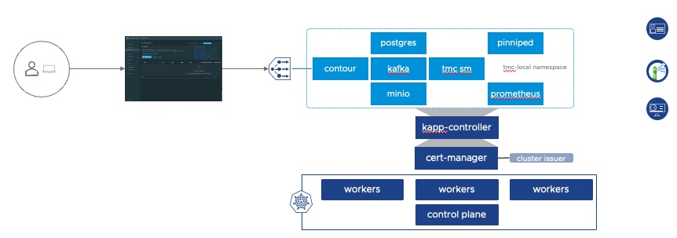

# Tanzu Mission Control - Self-Managed QuickStart

This is for testing and evaluation purposes only. This QuickStart guide is intended to install Tanzu Mission Control with minimal requirements. For production use cases, please refer to the official [documentation](https://docs.vmware.com/en/VMware-Tanzu-Mission-Control/1.0/Tanzumc-sm-install/index-sm-install.html)

Tanzu Mission Control, is a centralized hub for simplified, multi-cloud, multi-cluster Kubernetes management. More information can be found [here](https://Tanzu.vmware.com/mission-control)

Tanzu Mission Control has been available to operators as a SaaS offering but is now a deployable application to supported Kubernetes clusters called Tanzu Mission Control Self-Managed. This enables customers to utilize the fleet-wide management capabilities of Tanzu Mission Control in organizations where SaaS services are restricted, organizations that need complete application control, or air-gapped environments.

Read more about Tanzu Mission Control Self-Managed in this [release blog](https://Tanzu.vmware.com/content/blog/vmware-Tanzu-mission-control-self-managed-announcement)

# QuickStart Introduction
But what if you're just looking for a quick and easy way to test Tanzu Mission Control Self-Managed in your lab/test environment? 

Well, we got you covered, this QuickStart guide will guide you through the installation with minimal set of requirements.

## Prerequisite
- vSphere with Tanzu enabled on a vSphere cluster
- An Intel based operating system with
    - docker desktop installed
- A network accessible Harbor Registry
    - you need one public project for Tanzu Mission Control Self-Managed images
    - access to Tanzu packages repository - you can use the public repo projects.registry.vmware.com/tkg/packages/standard/repo
        - if you're working with an internet restricted environment, please [see documentation](https://docs.vmware.com/en/VMware-Tanzu-Kubernetes-Grid/1.6/vmware-Tanzu-kubernetes-grid-16/GUID-mgmt-clusters-image-copy-airgapped.html)

## In this guide we will deploy the following components
- Tanzu kubernetes cluster 1.23+
- cert-manager 0.11+
    - clusterissuer using a self-signed certificate (included)
- external-dns for dynamic dns configuration - this is optional but recommended "*"
    - the values provided in this guide are for configuring external-dns with a BIND server, if you're planning to use other or if you want more configuration option, please refer to this [docs](https://docs.vmware.com/en/VMware-Tanzu-Kubernetes-Grid/1.6/vmware-Tanzu-kubernetes-grid-16/GUID-packages-external-dns.html#prepare-the-configuration-file-for-the-externaldns-package-3)
- dex (OIDC provider)
- opendlap (for user authentication)



"*" *If you don't want to use dynamic dns configuration you can create two dns entries manually*
- tmc.mydomain.com 
- *.tmc.mydomain.com

DNS entries will point to the contour-envoy load balancer IP once deployed in step 6 - you can easily retrieve the IP using this command
```
kubectl -n tmc-local get svc contour-envoy -o jsonpath={'.status.loadBalancer.ingress[0].ip'}
```

# installation steps

## 1 - clone this repo
```
git clone https://github.com/hobovirtual/tmc-sm-quickstart-guide.git
cd tmc-sm-quickstart-guide
```
## 2 - push images to your harbor registry
### 2.1 - download and extract Tanzu Mission Control Self-Managed installer in the current directory (from your X86_X64 machine)
download from the [Customer Connect download site](https://customerconnect.vmware.com/en/downloads/info/slug/infrastructure_operations_management/vmware_Tanzu_mission_control_self_managed/1_0_0)

```
mkdir tmc
tar -xf tmc-self-managed-1.0.0.tar -C ./tmc
```

### 2.2 - add your harbor certificate
Update the bootstrap/harbor.crt file with your harbor certificate

### 2.3 - build local docker image

Now let's build our local docker image that will do the work for us

```
docker build -t bootstrap bootstrap/.
```

### 2.4 - push images to harbor
Update all values in {{}} with your registry values

| value | description |
| ----- | --------- |
| {{myharbor.mydomain.com}}| harbor fully qualified domain name or ip |
| {{myproject}}| public harbor project where all the container images will be stored |
| {{username}} | harbor username |
| {{passwword}} | harbor password |


```
docker run --rm -v $PWD/scripts:/work/scripts -v $PWD/images:/work/images -v $PWD/tmc:/work -e IMGPKG_REGISTRY_HOSTNAME={{myharbor.mydomain.com}} -e PROJECT={{myproject}} -e IMGPKG_REGISTRY_USERNAME={{username}} -e IMGPKG_REGISTRY_PASSWORD={{password}} -it bootstrap push-images
```

## 3 - create a Tanzu kubernetes cluster

### 3.1 - edit the tkc/tkc-tmc.yaml file with your values
Review and replace all values in {{}} and update with your own

| template value | example value |
| -------------- | ---------- |
| {{vsphere namespace}} | vns-sanbox |
| {{storageclass}} | vsan-default-storage-policy |


### 3.2 - create the Tanzu kubernetes cluster
Update all values in {{}} with your registry values

| value | description |
| ----- | --------- |
| {{supervisor ip-fqdn}} | vsphere with Tanzu supervisor fully qualified domain name or ip |
| {{username}} | supervisor username |
| {{passwword}} | supervisor password |

```
docker run --rm -v $PWD/scripts:/work/scripts -v $PWD/tkc:/work/tkc -e SUPERVISOR={{supervisor ip-fqdn}} -e USERNAME={{username}} -e KUBECTL_VSPHERE_PASSWORD={{password}} -it bootstrap tkc
```

## 4 - validate that kapp controller is available
Recent Tanzu Kubernetes releases should have kapp-controller installed, if you're using an older release, then please install it by following the [official documentation](https://docs.vmware.com/en/VMware-Tanzu-Kubernetes-Grid/1.6/vmware-Tanzu-kubernetes-grid-16/GUID-packages-prep-tkgs-kapp.html)

If you want to validate if kapp-controller is present in your Tanzu kubernetes cluster
```
kubectl -n tkg-system get po -l app=kapp-controller
```

## 5 - install and configure Tanzu packages

### 5.1 edit configuration files and update them with your values
Review and replace all values in {{}} and update with your own
#### config/common-values.yaml

| template value | example value |
| -------------- | ---------- |
| {{myharbor.mydomain.com}} | harbor.Tanzu.lab |
| {{myproject}} | tmc |
| {{mydomain.com}} | tmc.Tanzu.lab |
| {{ -----BEGIN CERTIFICATE----- -----END CERTIFICATE-----}} | your harbor certificate |

#### packages/standard/secrets.yaml (external-dns)

| template value | example value |
| -------------- | ---------- |
| {{owner id}} | tmc.Tanzu.lab |
| {{dns1, dns2}} | 192.168.2.1,192.168.1.1 |
| {{dns zone}} | Tanzu.lab |
| {{domain filter}} | Tanzu.lab |

*NOTE: If you don't want to use external-dns, you can either remove the section from the secrets.yaml and pkgi.yaml files or leave the default*

### 5.2 - install Tanzu packages (cert-manager and external-dns)

Update all values in {{}} with your registry values

| value | description |
| ----- | --------- |
| {{supervisor ip-fqdn}} | vsphere with Tanzu supervisor fully qualified domain name or ip |
| {{username}} | supervisor username |
| {{passwword}} | supervisor password |

```
docker run --rm -v $PWD/config:/work/config -v $PWD/scripts:/work/scripts -v $PWD/tkc:/work/tkc -v $PWD/packages:/work/packages -e SUPERVISOR={{supervisor ip-fqdn}} -e USERNAME={{username}} -e KUBECTL_VSPHERE_PASSWORD={{password}} -it bootstrap Tanzu-packages
```

## 6 - install configure Tanzu Mission Control Self-Managed
```
docker run --rm -v $PWD/config:/work/config -v $PWD/scripts:/work/scripts -v $PWD/tkc:/work/tkc -v $PWD/packages:/work/packages -e SUPERVISOR={{supervisor ip-fqdn}} -e USERNAME={{username}} -e KUBECTL_VSPHERE_PASSWORD={{password}} -it bootstrap tmc-install
```

*please note the Tanzu misssion control self-managed installation can take several minutes*
## What's next??
Tanzu Mission Control Self-Managed has now been successfully deployed! Access the interface by following using the credentials below.

https://tmc.{{mydomain.com}}

user  | password
----- |---------
Tanzu | VMware1!

To ensure new Tanzu Kubernetes Grid clusters can be managed by Tanzu Mission Control, a custom certificate must be added to the trusted section of your [TkgServiceConfiguration in vSphere with Tanzu](https://docs.vmware.com/en/VMware-vSphere/7.0/vmware-vsphere-with-Tanzu/GUID-4838C85E-398D-4461-9C4E-561FADD42A07.html#external-private-registry-configuration-5). 

Follow the documentation to add cert to the additionalTrustedCAs section and add the following lines under the spec section (please note that if you're using your own certificate you will need to modify the data value)

```
spec:
  trust:
    additionalTrustedCAs:
    - name: tmc-sm
      data: LS0tLS1CRUdJTiBDRVJUSUZJQ0FURS0tLS0tCk1JSUYxekNDQTcrZ0F3SUJBZ0lVUktsNVFacFB0amVDRHRWZlVDWjFPcUNYcXFvd0RRWUpLb1pJaHZjTkFRRUwKQlFBd2dZUXhDekFKQmdOVkJBWVRBbFJTTVJFd0R3WURWUVFJREFoSmMzUmhibUoxYkRFUk1BOEdBMVVFQnd3SQpTWE4wWVc1aWRXd3hGekFWQmdOVkJBb01Ea04xYzNSdmJXVnlMQ0JKYm1NdU1Rc3dDUVlEVlFRTERBSkpWREVwCk1DY0dBMVVFQXd3Z0tpNTBiV011YURKdkxUUXRNVEl3TWpJdWFESnZMblp0ZDJGeVpTNWpiMjB3SGhjTk1qTXcKTmpJd01UQXpPRFEwV2hjTk1qWXdOREE1TVRBek9EUTBXakNCaERFTE1Ba0dBMVVFQmhNQ1ZGSXhFVEFQQmdOVgpCQWdNQ0VsemRHRnVZblZzTVJFd0R3WURWUVFIREFoSmMzUmhibUoxYkRFWE1CVUdBMVVFQ2d3T1EzVnpkRzl0ClpYSXNJRWx1WXk0eEN6QUpCZ05WQkFzTUFrbFVNU2t3SndZRFZRUUREQ0FxTG5SdFl5NW9NbTh0TkMweE1qQXkKTWk1b01tOHVkbTEzWVhKbExtTnZiVENDQWlJd0RRWUpLb1pJaHZjTkFRRUJCUUFEZ2dJUEFEQ0NBZ29DZ2dJQgpBTVZVSzE4dXRKMk91U202Uy9WMDBJQXpiM0swTWhQUFNybEtkdlN2b3lRMzN6cHRVSjg2azBYYWhpNWNmaGtpCmZKdkNkbXJiVEpieGRBWnVyMFpCcXNTeDlnMkx6dkdocGJ6RElpM3dUMnd1NHd3bDZ4QzltbzRPTjI0aDdkVkEKbnc5Vm9jOUNDMDBWWWIxYWRlOTZobGpTRUhPeTM0UU50UG9KRm00d1JlOGJWcnpYZzE5dks2cTJNQTJlbzY2awpYOE5XTFJ0N0d5MXh5bXNpc0ppRGk4VDlLMmhQNHNGdHdJbEZrWENubEJVMHljYlFHSWFaNmFyRHJxZ0grNGt6ClRwZ3U5Uk0wVEpadmdBbEFQRGJmN2Zzd2JxWHAwMXM0b1JTZFZIbXBSZE5KQjh0OVE0V3ZDUWhWTTBPSVBsZ3gKOTNOMHhmZHo4ZGRCMDZOa1Q3czhjSFF4N3duMHZDTUJ6RTBvTzZDY0tnWlVTS0NmdGxhd2w0Q1J3eUlxNVA0dApGNmF6VWUxMEt5RFdvOG9VV3hNYmJQNFRqSmprWDgyck9BaHZMWmpPZi85ZmJTQUc4OS84MDBkU2Z4VlM1RW1ICjlGbWVBOHIvVTVUQ3dGbFoweURNTERKZzRNL3FISVJKcXlTMEZLNVVha3lDbG01MFROdXhvU3ZKKzREVWg0dm0KbjA3MWNjbGUyT2p6ZU5BbDNmclY4UTZtOUY3UkxQdTA1RGJXOXBadjd5cWMrT000ZXRKYUpDUllaVy9ZMG0vNQo0N2tOL3lCS29LM2h5bVpiWi9NNkh2aEd5WWRpVktsdEpYZVpMU2J1MTQ4WEV5Q2tpa2xoaHJHay95WEIyN2JLCjFuVURSU1FBbGlSNnptRlhzRDUwZlFLbkw4ak4vdjNVSHQxbnlmYTczV3dGQWdNQkFBR2pQekE5TUF3R0ExVWQKRXdRRk1BTUJBZjh3RGdZRFZSMFBBUUgvQkFRREFnR0dNQjBHQTFVZERnUVdCQlNQdmZDNGlBT1ZCS2lSbnNscApINDEvdHFEZGRUQU5CZ2txaGtpRzl3MEJBUXNGQUFPQ0FnRUFKaGE4M0syL1FRUlRydkdXT1pwSU9TQ0N5S3cyCnVkMlk2Wk4raiszY00xeVo3SDA0ZWU2OTd5NVlZVGpoVzczQ2tjVm8xbEJKY1hoYmVuNXcwV0RiK254Vmdxb2gKMVRXSkZXNTBLOXhwN3Z4MHc5NnIvWkhHSVBTSU5VbExHdTF2dWFjVm5aWDA2TFNYZXZ6aHF5ZFBzeE1pQnFmRApHa1FjSlNpVDZWUThVQTlrRjJXdEtKSmEvVWtjSndxZWZGenloWEx5dWVpaXhFbUhjZ25pclB3Q05DRTcwWHJoCnZrQ1ZLaHl2Zlo5aVRnYUlEZTJwNVNpamdteFFmSDQ4VmI4TndOdnNrL24rVGFnbGtzUVM2Y3BOdmxleHhSU1MKQ3RjbmFCU253UjBibDNEdStuajB0V3FybE54YmpWbWt4SjBEUXFIdmZHeFhjS2NMYThUd2JNcERtdzUybEdNaApiZ2hCM1hESGVRbXpvNXBsL24xYVFjR200Zk9LbTZxblBNVUhNZXZCT1VGdFlRSDlYM1FQdzZMUkcraU5paFhOCnU2ZXlGd2t2WXFTRUpxdld3OFNtL0t2QUo5Z1ppQys2emVXYTNMWmZTdHdmSGJlZkREL21TdUI3NEhCNHhSaW4KV3U2N1EyOHkzQXlIa2xVTm1hNlJGaUJtcnZsTTRoVzk3bFo3TGFxQnR0Y21WWmFHbVRseUNWRTFrTTE4TEF5RgpmQWlFN3g4UzJMRHdUWW1vTGZkQm1IbWZ5ZzY0RGNWdFdDV1dueXZkY29paEhFVWVTUEhCT2FUQWdCYlFaSTFuCm5FanB1bC9uUWpiZWU3RG85eGd2cXUrV3BzTXd3WVA3bnBUR3pOb3dtQkN3NE1RMmRJSExVbTJPT3FUckNQQ0YKOHhadC9vWU9HK1J1VXg4PQotLS0tLUVORCBDRVJUSUZJQ0FURS0tLS0t
```

If you want to add your supervisor cluster as a management cluster follow this [doc](https://docs.vmware.com/en/VMware-vSphere/7.0/vmware-vsphere-with-Tanzu/GUID-ED4417DC-592C-454A-8292-97F93BD76957.html)

If you want to attach a cluster, see this [doc](https://docs.vmware.com/en/VMware-Tanzu-Mission-Control/services/Tanzumc-using/GUID-6DF2CE3E-DD07-499B-BC5E-6B3B2E02A070.html)